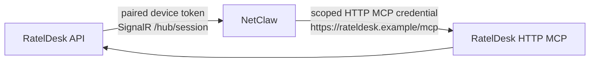

<p align="center"></p>

# RatelDesk

RatelDesk is a self-hosted, multi-tenant service desk for incidents, requests,
changes, work logs, knowledge, email workflows, and optional AI assistance.
It is built with ASP.NET Core and Blazor, and starts simply: SQLite and local
accounts are enough for a new installation.

Use this README to get running and choose a deployment path. The detailed
operator material lives in [self-hosting](docs/SELF_HOSTING.md),
[branding](docs/branding.md), and [release engineering](docs/releases.md).

## Start locally

You need Docker with Compose, or the .NET SDK pinned in
[global.json](global.json). From a checkout of this repository, start the
default stack:

```bash
docker compose -f docker/docker-compose.yml up --build
```

Open `http://localhost:8111/`. On a fresh installation, RatelDesk opens the
setup wizard. Retrieve the one-time setup code from the API container:

```bash
docker compose -f docker/docker-compose.yml exec api \
  dotnet /app/Helpdesk.API.dll --show-setup-code
```

Use the code to unlock setup, then choose storage, name the instance, and
create the first administrator. The setup code unlocks only the wizard; it is
not a login or MFA credential. Initial local-account sign-in does not require
an authenticator. MFA is requested only after an account enables it.

If you deploy through a container manager, run the equivalent command on the
Docker host. Replace `rateldesk-api-1` with the name shown by `docker ps`:

```sh
docker ps --format 'table {{.Names}}\t{{.Image}}'
docker exec rateldesk-api-1 dotnet /app/Helpdesk.API.dll --show-setup-code
```

Inside the API container, `dotnet /app/Helpdesk.API.dll --show-setup-code` is
enough; the image includes `sh`, not Bash. If the code cannot be retrieved,
run the command with `--setup-status` and follow the
[setup troubleshooting guide](docs/SELF_HOSTING.md#setup-code-and-container-troubleshooting).
These read-only commands require rc.5 or later.

The default Compose stack runs Web and API in Production mode over localhost
HTTP and persists SQLite, bootstrap, data-protection, and attachment volumes.
Its local-account cookie uses the valid `RatelDesk.Local` name. Public
deployments need HTTPS and must remove `Authentication__AllowInsecureLocalhost`.
For local .NET development, run API and Web with durable local paths; the same
`/setup` flow initializes a fresh database.

## Choose storage and a release path

SQLite is the simplest choice for a new instance. PostgreSQL is available for
larger or externally managed deployments, and is required for native ticket AI
Assistant chat. SQLite still supports webhook AI assistance and its history.

For a fresh bundled PostgreSQL installation, add the sidecar overlay and supply
a unique password outside source control:

```bash
RATELDESK_POSTGRES_PASSWORD='replace-with-a-secret' \
  docker compose -f docker/docker-compose.yml \
  -f docker/docker-compose.postgres.yml up --build
```

At `/setup`, select PostgreSQL and use host `postgres`, port `5432`, database
`rateldesk`, user `rateldesk`, and that password. For an external PostgreSQL
server, run the normal stack and enter its reachable, empty target in setup.
The full requirements for TLS, upgrades, backups, recovery, and unattended
initialization are in [self-hosting](docs/SELF_HOSTING.md#external-postgresql).

To run published images rather than build from source, choose an exact release
version:

```bash
RATELDESK_VERSION=0.1.0 docker compose -f docker/docker-compose.release.yml up -d
```

Use an exact SemVer version, or preferably published image digests, in
production. `latest` follows stable releases only; prereleases never move it.

## Operate safely

Most first-run configuration belongs in the setup wizard. Deployment-owned
settings are supplied as environment variables or secret mounts. Common ones
include:

- `Database__Provider` and `ConnectionStrings__HelpdeskDb` for an explicit
  PostgreSQL deployment.
- `Authentication__Mode` and the Authentik or Microsoft Entra settings for
  local, OIDC, or hybrid sign-in.
- `DataProtection__KeyRingPath` and `StorageOptions__RootPath` for durable
  production storage.
- Email, telemetry, branding, AI, MCP, and orchestration settings when those
  integrations are enabled.

`/tmp/rateldesk/keys` is a local fallback, not a production key store. Back up
the database, bootstrap state, data-protection keys, and attachments together.
See [self-hosting](docs/SELF_HOSTING.md) for the complete configuration and
operating guidance.

## NetClaw AI Assistant and MCP

NetClaw is a first-class companion for the ticket AI Assistant. It connects to
RatelDesk in two separate, complementary directions:



The first connection lets RatelDesk run a ticket conversation through NetClaw.
The second gives NetClaw carefully scoped RatelDesk tools. They use different
credentials, have different purposes, and must never be substituted for one
another.

Read the [NetClaw integration guide](docs/netclaw.md) and the
[NetRatel orchestrator guide](docs/integrations/netratel-orchestrator.md)
before enabling either
path. It covers pairing, SignalR recovery, the optional HTTP MCP host,
tenant-per-NetClaw boundaries, least privilege, credential rotation, and a
copy/paste-safe NetClaw CLI onboarding flow.

## API, CLI, and MCP

The web-hosted [RatelDesk API reference](/api/docs) documents the public API.
Browser sign-in uses a CSRF-protected cookie; that cookie is not a CLI or MCP
Bearer credential.

For automation, create an account-owned integration credential at
`POST /api/v1/integration-credentials` after normal sign-in and configured MFA.
The secret is displayed once. Put it in a protected configuration file or
secret mount. Its access is always the intersection of the account's current
authorization, selected permissions, and organization scope; revocation and
account disablement take effect on later requests.

GitHub Releases include self-contained `rateldesk` CLI and `rateldesk-mcp`
stdio MCP archives for Linux x64/arm64 and Windows x64. Linux archives require
a glibc distribution, not Alpine/musl. Both support offline `--help` and
`--version` before loading credentials.

HTTP MCP is optional and separate from the base Web/API stack. Its source and
release overlays are documented in the
[HTTP MCP example](docker/examples/mcp-http/README.md). Authentik HTTP MCP
mode is a separate external-identity integration; it is not a fallback for
local paired credentials.

## Documentation and contribution

| Need | Read |
| --- | --- |
| Install, configure, secure, or recover an instance | [Self-hosting](docs/SELF_HOSTING.md) |
| Connect NetClaw AI Assistant and tenant-scoped MCP | [NetClaw integration](docs/netclaw.md) |
| Configure the NetRatel orchestrator | [NetRatel orchestrator](docs/integrations/netratel-orchestrator.md) |
| Brand an instance without forking | [Branding](docs/branding.md) |
| Build and publish releases | [Release engineering](docs/releases.md) |

Read [CONTRIBUTING.md](CONTRIBUTING.md) before opening a change. Report
vulnerabilities privately under [SECURITY.md](SECURITY.md).

## License

RatelDesk is licensed under the [Apache License 2.0](LICENSE).
