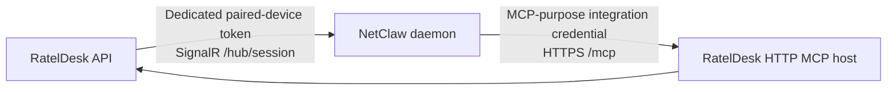

# NetClaw AI Assistant and tenant-scoped MCP

NetClaw can work with RatelDesk in two directions. They are complementary, but
they are not the same integration and they do not share credentials.



- **RatelDesk to NetClaw** powers the ticket **AI Assistant** conversation.
  RatelDesk API, not a browser, holds the paired-device token and opens the
  SignalR connection.
- **NetClaw to RatelDesk** gives NetClaw tenant-scoped RatelDesk tools through
  the optional HTTP MCP host.

For production, use one dedicated NetClaw deployment, RatelDesk account, MCP
credential, and organization scope for each tenant. A NetClaw deployment or
credential for one tenant must not be used to reach another tenant.

## Before you begin

You need a working RatelDesk instance, a NetClaw daemon, and an operator who
can manage both. Native ticket chat additionally requires PostgreSQL and is
disabled by default. SQLite supports webhook AI assistance and investigation
history, but not native SignalR chat.

Choose the network shape before creating credentials:

| Shape | Appropriate use | Boundary to keep |
| --- | --- | --- |
| Private network or local evaluation | Short-lived evaluation where both services are controlled | Do not expose the daemon or MCP port publicly. Private HTTP is a deliberate exception, not a production default. |
| Tailnet | Remote access limited to trusted devices | Keep NetClaw reachable only to the intended tailnet. |
| Reverse proxy with DNS and TLS | A managed public or private service endpoint | Proxy SignalR and HTTP MCP correctly; configure NetClaw trusted proxies. |
| Managed tunnel | A deliberate alternative to a direct public edge | Apply the tunnel provider's access policy and retain NetClaw device authentication. |

RatelDesk owns ticket authorization, organization scope, and the MCP gateway.
NetClaw owns its daemon, paired devices, model and tool policy. The reverse
proxy terminates TLS and forwards only the routes it is configured to expose.
DNS names identify those public endpoints; they do not grant access.

NetClaw's [exposure modes](https://netclaw.dev/deployment/exposure-modes/)
and [remote-device pairing guide](https://netclaw.dev/guides/pairing-remote-devices/)
describe the daemon-side choices. Do not copy a private IP address, token, or
internal host name into tracked configuration or support tickets.

## Connect RatelDesk to NetClaw for ticket chat

Create a dedicated NetClaw paired device for the RatelDesk API. Give it a
recognizable tenant-specific name, such as `rateldesk-tenant-a-api`. Use
NetClaw's one-time pairing flow from a secure operator environment; on an
existing daemon, that begins with `netclaw daemon pair`. The resulting device
token is a secret for RatelDesk API only.

Store the token directly in the deployment's secret manager or protected
runtime configuration. Never put it in an appsettings file, Compose file,
browser configuration, shell history, ticket, issue, pull request, or example.
If NetClaw CLI pairing is used, its local secret file is also sensitive; move
the token into the approved RatelDesk secret store without pasting it into a
tracked file.

Configure the **API service only**. The canonical beta.4 namespace is
`Netclaw__...`; replace the example endpoint and inject the token through your
secret mechanism:

```text
Netclaw__Enabled=true
Netclaw__Instance=dev
Netclaw__Endpoint=https://netclaw.example.com/hub/session
Netclaw__DeviceToken=<secret injected at runtime>
Netclaw__AllowPrivateHttp=false
Netclaw__IdleMinutes=15
Netclaw__ConnectionCapacity=25
Netclaw__TurnInactivityTimeout=00:05:00
Netclaw__ActivityHeartbeatInterval=00:00:15
```

The former `AiAssistantChat__...` names remain readable as a migration alias.
At the same configuration-provider priority, `Netclaw__...` wins. A higher
priority legacy source can override a lower-priority canonical source, as with
normal .NET configuration precedence. Deployment-managed configuration is
read-only in the Integration hub; otherwise the administrator can persist a
protected profile in the database. The profile records revision, applied, and
last-test metadata without returning the paired-device token.

The endpoint must be an absolute URL with exactly the `/hub/session` path. Use
HTTPS in normal deployments. RatelDesk accepts HTTP only when
`Netclaw__AllowPrivateHttp=true` and the endpoint resolves to a private
literal IPv4 or IPv6 address (including IPv6 ULA); that exception is for a
trusted private network, not a DNS name or public service.

When NetClaw is behind a reverse proxy, forward SignalR/WebSocket upgrades and
long-lived connections to `/hub/session`. Configure the daemon's non-local
exposure mode and trusted proxy addresses as NetClaw requires. For a tailnet or
tunnel, use the endpoint and exposure mode documented by that provider.

After restarting the API service, open an authorized incident, request, or
change and select **AI Assistant**. Send a harmless test prompt, then refresh
or reconnect the browser and confirm the saved conversation recovers. A failed
or silent transport is not a reason to resend a message: use the ticket UI's
recovery controls so an already admitted turn cannot be duplicated.

The Integration hub's **Test draft** action validates the edited endpoint and
token without saving, applying, or recording the draft. **Test saved
configuration** validates the currently applied profile and records only
protected metadata. A real daemon pairing, SignalR session, reconnect, and
post-restart ticket journey still require an authorized NetClaw environment;
repository tests do not substitute for that external acceptance.

### Rotate or revoke the chat device

Rotate the paired device token using the current NetClaw device-management
flow. Put the replacement directly into the RatelDesk API secret store, restart
only the API service, and verify one harmless ticket conversation before
retiring the old token. If an API host is lost, an employee leaves, or the
tenant relationship ends, revoke the paired device in NetClaw and remove the
RatelDesk runtime secret. Revocation prevents later connections; it does not
make an already admitted remote action disappear.

## Connect NetClaw to RatelDesk with HTTP MCP

HTTP MCP is optional and runs separately from RatelDesk Web/API. Use the
local-account paired gateway mode for this guide. It exchanges the incoming
MCP credential for a short-lived execution credential and does not forward the
long-lived credential to ordinary API operations.

Follow the [HTTP MCP deployment example](../docker/examples/mcp-http/README.md)
for the source or released-image overlay. It requires a protected gateway
configuration file, an exact RatelDesk API base URL, and these public values:

- `RATELDESK_MCP_PUBLIC_RESOURCE_URI` is the exact public HTTPS URI ending in
  `/mcp`, for example `https://rateldesk.example.com/mcp`.
- `RATELDESK_MCP_ALLOWED_ORIGIN` is the exact browser origin when browser MCP
  access is required.

The MCP container listener does not provide public TLS by itself. Your proxy
must serve the canonical HTTPS `/mcp` route and the protected-resource metadata
route, preserve `Authorization` and MCP protocol headers, and allow streaming
responses without buffering or caching them. This is separate from the SignalR
proxy route above. Do not expose the gateway configuration file, API database,
or data-protection key ring to the MCP container.

### Create the RatelDesk credential

Sign in as the account that should own the NetClaw integration, complete any
configured MFA, and open **Account → Integration credentials**.

1. Create a credential named for this NetClaw tenant and purpose.
2. Select **HTTP MCP** as the purpose.
3. Select exactly one enabled RatelDesk organization.
4. Enter the same canonical public `https://…/mcp` URI configured on the MCP
   gateway. It must be HTTPS, end in `/mcp`, and have no query string or
   fragment.
5. Select only the permissions this NetClaw role needs, and set a short,
   operationally manageable expiry (RatelDesk permits 1–90 days).
6. Save the secret when it is shown. RatelDesk never displays it again.

Put that secret only in NetClaw's protected configuration. Do not add it to
RatelDesk deployment configuration, a shell profile or history, tickets,
issues, pull requests, screenshots, or documentation examples.

An API/CLI credential, a stdio-MCP credential, and an HTTP-MCP-purpose
credential are not interchangeable. The effective access of the HTTP MCP
credential is the intersection of the owner's current RatelDesk authorization,
the credential's selected permissions, and its organization scope. Disabling
the owner, removing access, expiring, or revoking the credential takes effect
on later requests.

### Register the server in NetClaw

Run this on the NetClaw host or its secure operator environment. It prompts for
the one-time credential instead of placing it in the command line or shell
history. The NetClaw CLI writes header values to its protected secret storage.

```bash
read -r -s -p "RatelDesk MCP credential: " RATELDESK_MCP_TOKEN
printf '\n'
netclaw mcp add rateldesk-tenant-a https://rateldesk.example.com/mcp \
  --transport http \
  --header "Authorization: Bearer $RATELDESK_MCP_TOKEN"
unset RATELDESK_MCP_TOKEN

# Restart the NetClaw daemon using its normal service-management method,
# then confirm discovery and explicitly grant the tools that may be used.
netclaw mcp list
netclaw mcp permissions
```

Replace the name and URL, but do not change the credential's canonical URI to
make it fit a proxy alias. Review `netclaw mcp permissions` immediately after
registration and choose grants and approval mode for every audience. Do not
assume the defaults are safe for this integration: current NetClaw releases
auto-approve all tools for the Personal audience, while Team and Public start
with no grants. Keep write or destructive tools on approval unless there is a
reviewed reason to automate them. The
[NetClaw MCP CLI reference](https://netclaw.dev/cli/mcp-tools/) documents the
current command behavior and the protected configuration split.

### Choose least privilege deliberately

Create separate credentials and NetClaw MCP entries when roles differ:

| Intended role | Recommended scope |
| --- | --- |
| Incident manager | One tenant; only the incident read and change permissions needed by its runbook. |
| Change manager | One tenant; only the change read, planning, and approved update permissions needed by its change process. |
| Read-only support triage | One tenant; read-only ticket, work-log, and search permissions. |
| Disposable broad test | A separate non-production tenant, account, NetClaw deployment, credential, and short expiry. Never reuse it for production. |

Do not treat a broad test credential as a shortcut to a second tenant. A
credential scoped to one organization cannot lawfully expand the owner account
or NetClaw deployment into another organization.

## Troubleshooting and lifecycle

| Symptom | Check first |
| --- | --- |
| AI Assistant cannot connect or reconnect | Confirm PostgreSQL and `Netclaw__Enabled`; validate the exact `/hub/session` URL, TLS chain, paired-device token, proxy WebSocket forwarding, and NetClaw exposure mode. Run `netclaw doctor` on the daemon host. |
| AI Assistant is unavailable after a restart | Confirm the API has the current injected token and that the token was not placed on the Web service. Use the ticket UI recovery path; do not blindly resend an uncertain turn. |
| HTTP MCP returns `401` | Treat this as a credential, expiry, owner, purpose, resource-URI, permission, or organization-scope problem. Compare the exact configured and credential-bound public `/mcp` URI, then rotate or recreate the credential if necessary. |
| Proxy rejects or cannot reach `/mcp` | Check DNS, TLS, proxy route, forwarded `Authorization` and MCP headers, streaming behavior, and the MCP host health. This is distinct from a RatelDesk authorization failure. |
| NetClaw lists the server but no tools run | Restart or reload the daemon as appropriate, confirm `netclaw mcp list` reports discovery, then review explicit grants and approval policy with `netclaw mcp permissions`. |

Review every paired device and integration credential when an employee changes
role or leaves, a tenant is removed, or a test deployment is retired. Rotate
credentials before expiry, revoke rather than merely rename compromised or
unused credentials, and keep production and disposable test tenants separate.
